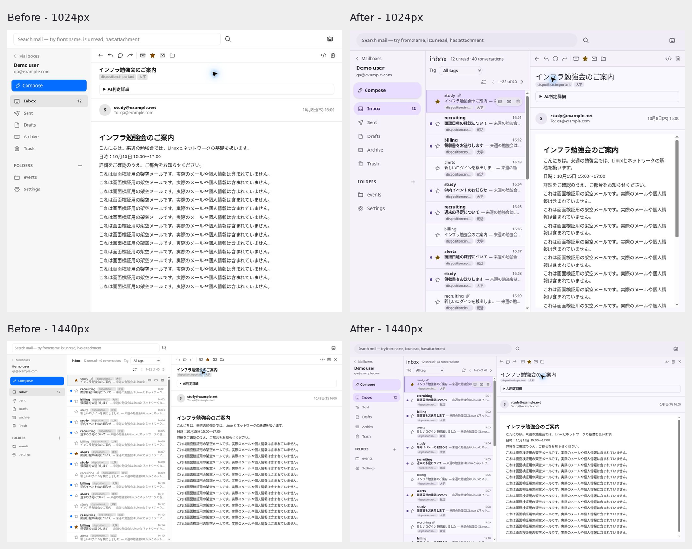
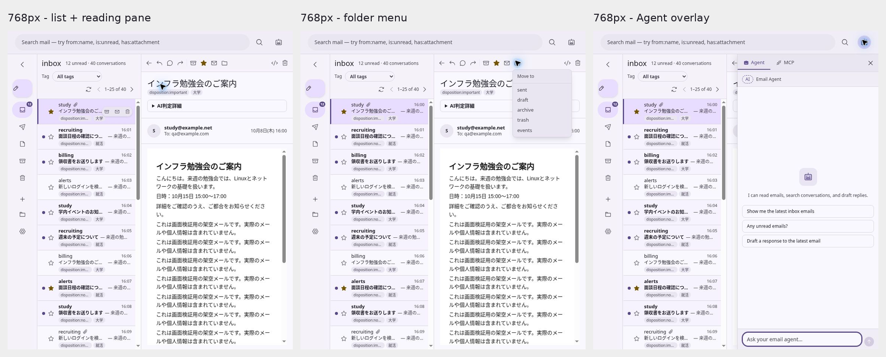
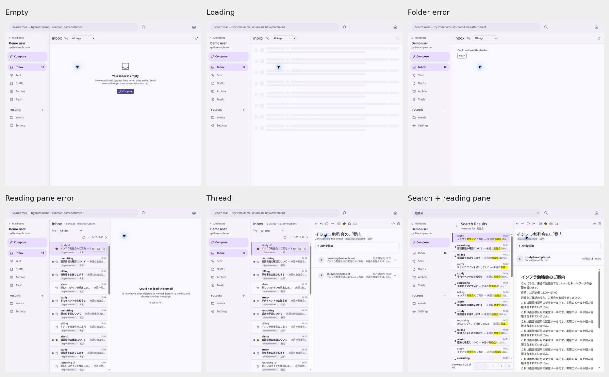

<!-- SPDX-License-Identifier: Apache-2.0 -->

# Issue #65 validation

## Layout and browser evidence

The user's explicit instruction overrides Issue #65's older 1280px threshold:
opening an email keeps its list on the left and its reading pane on the right
from 768px, including iPad portrait widths. Only phone widths use a single pane.

The following widths were measured in the rendered React application using
browser DOM geometry after selecting a mail row. The viewport height was 860px.

| Viewport | Navigation | Selected list width | Detail width |
| --- | --- | --- | --- |
| 768px | 80px rail | 280px | 408px |
| 820px | 80px rail | 280px | 460px |
| 1024px | 232px drawer | 320px | 472px |
| 1280px | 232px drawer | 400px | 648px |
| 1440px | 232px drawer | 400px | 808px |
| 1536px | 232px drawer | 440px | 864px |
| 767px | Mobile navigation | Hidden | 767px |

With no selected message, the list fills the content area. At 390px the mobile
mail reader also retains its single-pane layout.

The comparison uses baseline `24652d4eb578a8214cee430bc2bb8689b1773d32` and
this branch, with identical synthetic mail. At 1024px the baseline hides the
list, while the updated layout keeps both panes visible. At 1440px both versions
split, with updated Material 3 chrome and compact tag placement in this branch.

[390px mobile reading pane](phone.png)

## Browser verification method

The direct Worker development server was unreachable from the cloud browser,
and opening a local fixture as a file was rejected by browser URL policy.
A supervised HTTP preview subsequently made visual QA possible. The browser
service also timed out once; it recovered before these checks were performed.
No file-policy workaround or production deployment was used.

A disposable React fixture imported the actual Mailbox, EmailList, Search,
Sidebar, MailboxSplitView, EmailPanel, ComposePanel and Agent presentation
components. It used each source tree's built production CSS. A MemoryRouter
mounted the mailbox routes. The fixture replaced API methods with synthetic
mailbox/folder/mail/tag/thread responses and disabled real agent connections.
React Query errors and indefinitely pending promises produced the failure and
loading states. A plain HTTP server served only the fixture's static files.

The data consisted of 40 fictional emails at example.com/example.net addresses,
read/unread and starred rows, ordinary/disposition tags, Japanese subjects,
long repeated HTML body paragraphs, and a two-message conversation. No real
mail, credentials, or production services were accessed.

Viewport width was controlled by the fixture iframe, which supplies the actual
CSS viewport for the application. Mail was opened by clicking a row, rather
than substituting a hand-built visual mockup. Screenshots were captured from
Chromium, cropped to the application frame and assembled with Pillow; image
composition added only labels and spacing. The images retain their rendered
content. Screenshot cursors and hover actions are present in some captures.

## Completed checks

- Both panes remain visible at 768, 820, 1024, 1280, 1440 and 1536px; the measured
  widths are listed above. 767px and 390px retain single-pane mail reading.
- List and sandboxed body scrolling are independent: keyboard PageDown moved
  the list to 620px; body scrolling then moved its own scroll position while
  leaving the list at 620px.
- Selected row border/background, unread dot/weight, stars, tags and row hover
  actions were observed in the real render.
- The Move to folder menu opens without clipping at 768px; Escape dismisses it
  without closing the message.
- Agent/MCP tabs render at 768px. Closing the overlay preserves the selected
  message. Agent network behavior was deliberately mocked.
- Search result selection preserves the list beside the reader. Reply and new
  compose panels open, and closing compose returns to the prior view.
- Tag selection filters rows; pagination advances from 1–25 to 26–40 of 40.
- `/` focuses the search field; Escape from the selected row closes the reader.
- Empty, loading, folder-error, detail-error and two-message thread views render.
  A detail failure leaves the email list available.
- At 390px, next/previous controls change the displayed subject and Back to list
  restores the list.
- Browser QA found two defects: Kumo's primary Compose variant forced white
  text on a pale tonal background, and a 56px tablet navigation item exceeded
  its available width by 1px. Compose now uses the secondary variant; rail items
  have max-width: 100%. The updated tablet nav was measured at clientWidth =
  scrollWidth = 79px, eliminating its horizontal scrollbar.
- Static peer review previously caught a clipped folder menu caused by toolbar
  horizontal overflow. Controls wrap instead.
- All 154 deterministic tests passed. Type checking, production compilation,
  license checking and diff whitespace checking passed.

## Scope and limits

This confirms the actual frontend render with synthetic API data, not a full
Worker/Cloudflare integration test. Real sending, saving drafts, MCP/agent
requests, mutation persistence, browser-history navigation and physical iPad
Safari/touch/safe-area behavior were not tested here. Compose preservation
through a live resize was not checked because changing fixture width remounts
its iframe. The inspected browser error logs contained extension metadata
errors; this is not an assertion of error-free production network behavior.

Shared mobile token aliases retain their previous literal values. Mobile
component files and email sandbox rules were not changed. There are no backend,
schema, API, binding or dependency changes, and no migration is required.
Upstream synchronization must preserve the 768px split and existing mobile
navigation/state behavior. No production deployment was performed.

This implementation was assisted by Codex and GPT-6-Luna. No Gmail/Outlook
source, branded assets, proprietary fonts or external prototype code was
imported. Screenshot images are generated/derived evidence (class E); rendered
dependency elements still require human rights review. Human code and
provenance/licensing review remains required before merge.
